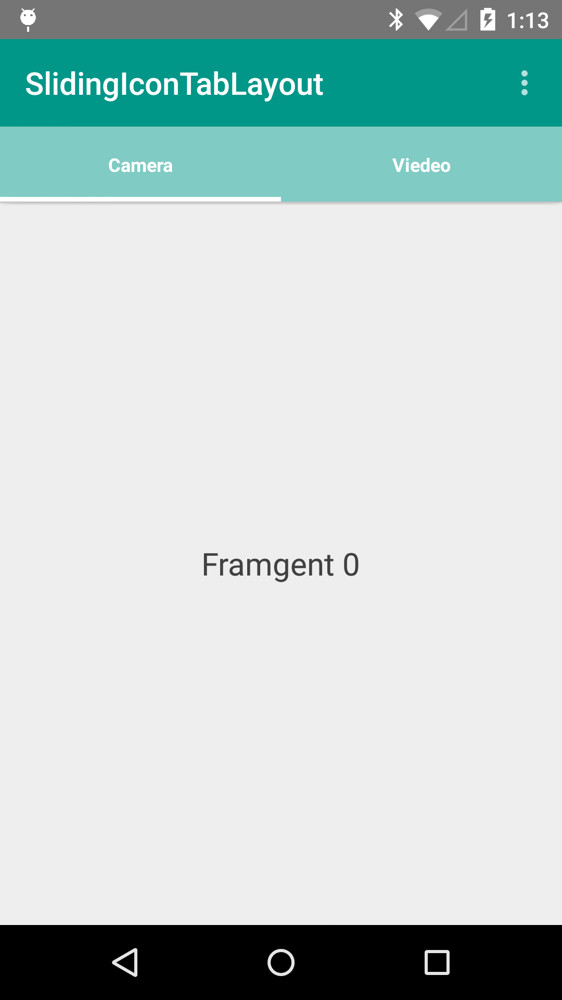

# SlidingIconTabLayout Sample

A basic sample which shows how to use SlidingTabLayout with not only Text but also Icon for tab layout. 

# Usage
You can copy SlidingTabLayout file to your widgets folder with SlidingTabStrip.

# Developed By
* Kevin Yongjun Kim - imkimkevin@gmail.com

# Contributing
All contributions are welcome. Open a [Pull Requests](https://github.com/kimkevin/SlidingIconTabLayout/pulls) or refer to
the [Issues](https://github.com/kimkevin/SlidingIconTabLayout/issues) section.

# License
    Copyright 2015 William Mora

    Licensed under the Apache License, Version 2.0 (the "License");
    you may not use this file except in compliance with the License.
    You may obtain a copy of the License at

        http://www.apache.org/licenses/LICENSE-2.0

    Unless required by applicable law or agreed to in writing, software
    distributed under the License is distributed on an "AS IS" BASIS,
    WITHOUT WARRANTIES OR CONDITIONS OF ANY KIND, either express or implied.
    See the License for the specific language governing permissions and
    limitations under the License.
